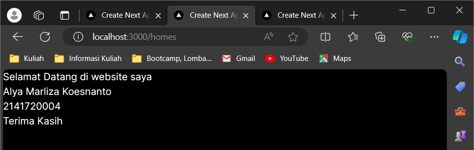

This is a [Next.js](https://nextjs.org/) project bootstrapped with [`create-next-app`](https://github.com/vercel/next.js/tree/canary/packages/create-next-app).

## Getting Started

First, run the development server:

```bash
npm run dev
# or
yarn dev
# or
pnpm dev
# or
bun dev
```

Open [http://localhost:3000](http://localhost:3000) with your browser to see the result.

You can start editing the page by modifying `app/page.tsx`. The page auto-updates as you edit the file.

This project uses [`next/font`](https://nextjs.org/docs/basic-features/font-optimization) to automatically optimize and load Inter, a custom Google Font.

# **Laporan Praktikum**

|  | Pemrograman Berbasis Framework 2024 |
|--|--|
| NIM | 2141720004 |
| Nama | Alya Marliza Koesnanto |
| Kelas | TI - 3A |

## **Jawaban Soal 1**
* **TypeScript**

Merupakan bahasa pemrograman yang berbasis JavaScript dengan penambahan fitur _strong-typing_ dan menggunakan konsep pemrograman _OOP_ klasik _(Class Interface)_ yang dimana dalam dokumentasi sering disebut sebagai _super-set_ dari JavaScript. Beberapa hal yang ditawarkan oleh TypeScript antara lain _class_, _module_, dan _interface_ yang membuat developer dapat mengembangkan aplikasi secara kompleks jauh lebih mudah.

* **ESlint**

Merupakan alat linter yang sangat populer pada JavaScript. Alat ini berfungsi dalam membantu menemukan dan memperbaiki kesalahan dalam gaya penulisan yang tidak konsisten serta membantu dalam menerapkan pedoman terbaik pada JavaScript.


* **Tailwind CSS**

Merupakan kerangka kerja CSS yang selalu digunakan dalam pembuatan dan pengembangan suatu website dengan mempercepat pembuatan aplikasi dengan menggunakan desain _custom_. Yang dimana utilitas ini digunakan untuk membuat desain khusus pada file HTML dan pada utilitas ini developer dapat mengontrol layout, warna, spasi, tipografi serta komponen website lainnya agar desain yang diciptakan untuk komponen tersebut bisa memenuhi atau sesuai dengan kebutuhan.

* **App Router**

Merupakan alat yang dimana alat ini melakukan pemodelan baru pada pembangunan aplikasi dengan menggunakan fitur terakhir pada react seperti _Server Components_, _Streaming with Suspense_, dan _Server Actions_.

* **Import Alias**

Merupakan alat pada Next.js yang digunakan untuk membuat jalur impor yang lebih pendek dan deskriptif pada modul yang dimana hal ini sangat membantu dan membuat basis kode pemrograman jadi lebih bersih dan mudah untuk dirawat sekaligus menghindari jalur yang relatif panjang pada saat mengerjakan proyek yang besar.

## **Jawaban Soal 2**


* **node_modules**
Merupakan direktori yang berfungsi sebagai tempat yang menyimpan dan mengolah dependensi atau pustaka dari pihak ketiga yang digunakan dalam proyek yang berbasis JavaScript.

* **public**
Merupakan direktori yang berfungsi untuk menyediakan file statis seperti gambar.

* **src**
Merupakan direktori yang mendukung pola umum pada penempatan kode pemrograman aplikasi. Hal ini memisahkan kode pemrograman dari file konfigurasi proyek yang berada pada root proyek.

* **.elintsrc**
Merupakan file yang berfungsi dan didesain untuk mengidentifikasi serta memperbaiki kesalahan pada kode pemrograman.

* **.gitignore**
Merupakan file yang mencegah Git untuk melaporkan perubahan pada file.

* **next.config.mjs**
Menyesuaikan dan mengkonfigurasi berbagai aspek dari Next.js seperti pengaturan lingkungan dan pengaturan lainnya.

* **next-env.d.ts**
Berkas Typescript declaration yang dihasilkan oleh Next.js dengan isi deklarasi yang diperlukan untuk dukungan pada Typescript diproyek Next.js.

* **package.json**
Manifest Node.js yang mendefinisikan informasi tentang proyek, dependensi, skrip yang dapat dijalankan, dan lain-lain. Ini digunakan oleh npm atau Yarn untuk mengelola proyek.

* **package-lock.json**
Berkas npm yang mencatat versi spesifik dari setiap paket yang diinstal dan memastikan konsistensi versi paket di seluruh tim dan lingkungan.

* **postcss.config.js**
Konfigurasi pada PostCSS, alat yang digunakan untuk mengotomatisasi transformasi CSS dan digunakan dalam pengembangan aplikasi web modern untuk mengaktifkan fitur-fitur seperti prefix vendor, menggabungkan file CSS, dll.

* **README.md**
Markdown yang berisi dokumentasi proyek untuk memberikan informasi tentang proyek, cara penggunaan, kontribusi, dan informasi lain yang relevan untuk pengembang atau pengguna lainnya.

* **tailwind.config.ts**
Konfigurasi untuk Tailwind CSS, sebuah kerangka kerja CSS dan menyesuaikan konfigurasi Tailwind CSS sesuai kebutuhan proyek mereka.

* **tsconfig.json**
Konfigurasi TypeScript yang mendefinisikan pengaturan kompilasi untuk proyek Next.js dan melakukan penyesuaian pada pengaturan TypeScript seperti target kompilasi, jalur pencarian, dan lainnya.


## **Jawaban Soal 3**

Hal tersebut terjadi karena adanya beberapa kombinasi dari fitur-fitur seperti HMR (Hot Module Replacement), Development Server yang terus berjalan yang selalu memantau perubahan file secara realtime, pemantauan file aktif, dan integrasi yang kuat dengan React untuk mendukung fitur HMR bekerja agar pengembangan jauh lebih responsif dan efisien.

## **Jawaban Soal 4**

Perubahan tampilan terjadi karena disini hanya menggunakan komponen React dalam bentuk fungsi saja yang dimana fungsi javascript disini hanya difokuskan dalam bentuk keluaran text dan belum menggunakan komponen bantuan seperti tailwind css dan juga ditambah ada perubahan pada routing yang awalnya belakang hanya ada angka 3000 lalu ditambah dengan /users.

## **Jawaban Soal 5**

Ada perubahan namun tidak terlalu signifikan, sama seperti sebelumnya hanya isinya yang cukup diubah sedikit dan adanya penambahan routes yang teridentifikasi sebagai /homes.

## **Jawaban Soal 6**


## **Jawaban Praktikum Remix dan Gatsby**
Perbedaan antara Next.js, Remix, dan Gatsby adalah:
* Next.js

Next,js dikenal lebih fleksibel, berfokus pada kinerja dan kemudahan dalam penggunaan, serta fleksibilitas yang tinggi dalam memanajemen data dan integritas teknologi.

* Remix

Dikenal menggabungkan komponen SSR, SSG dan client-side rendering, menekankan pengalaman dalam pengembangan serta kinerja, dan memperkenalkan konsep "Server Components" sebagai pemisah antara logika server dengan klien.

* Gatsby

Dikenal mengutamakan pembangunan website statis yang dioptimalkan, menggunakan SSR sebagai pendekatan pada SSG untuk kinerja dan SEO, dan ekosistem plugin yang kuat untuk integrasi data serta layanan.
